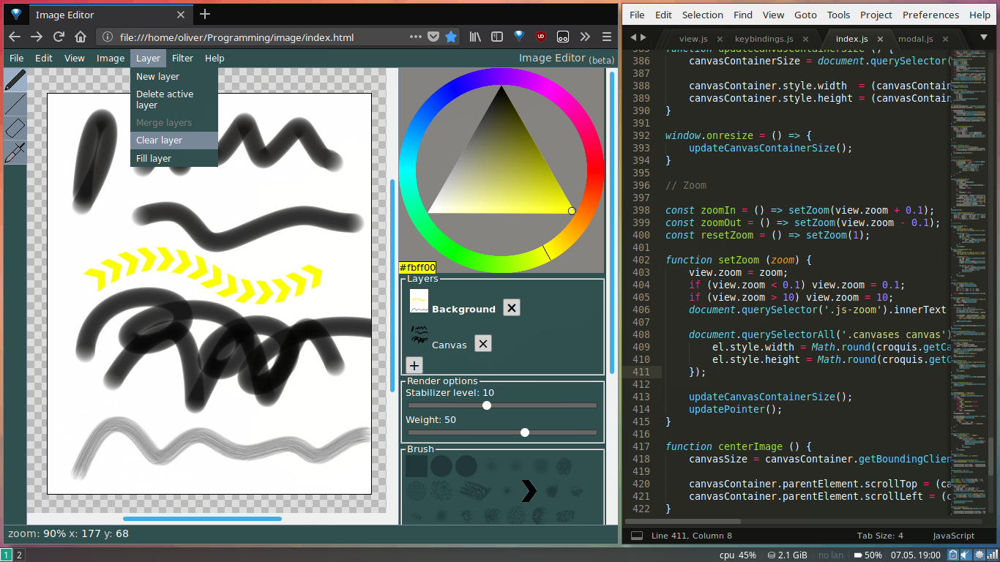

# Image Editor (beta)

Available at: https://tobsta.github.io/ImageEditor/

Basic HTML5 canvas based image editor built for the web and for ChromeOS with a neat colour picker, stylus/drawing tablet support, Photoshop-like brushes, and all the usual stuff you'd expect in an image editor.

It is currently beta; it's usable and should work flawlessly in any modern browser &mdash; but it's not finished, and it's not necessarily bug-free either.
